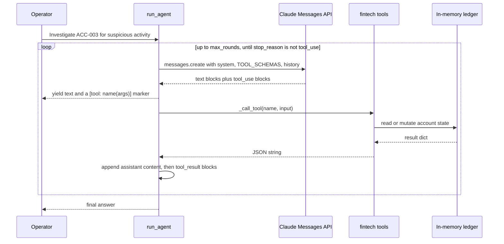

# Ops Pilot

Conversational ops agent for fintech workflows: an Anthropic Claude tool-use loop wired to fintech back-office operations (account lookup, transactions, fraud check, freeze/unfreeze, alerts) exposed over a FastAPI surface. Operators issue natural-language instructions; the model decides which tools to call and chains multi-step actions until the task is complete. No frontend.

## Overview

- **8 fintech tools** — `get_account`, `list_transactions`, `flag_transaction`, `freeze_account`, `unfreeze_account`, `run_fraud_check`, `add_transaction`, `get_alerts`
- **Anthropic tool-use loop** — multi-turn agentic loop using `claude-sonnet-4-6` with structured tool schemas; continues until `stop_reason != "tool_use"`
- **Fraud check** — rule-based scoring: account flags + large-transaction count + velocity + freeze status → LOW / MEDIUM / HIGH risk level
- **Auto-escalation** — system prompt instructs agent to auto-freeze HIGH risk accounts; confirm on MEDIUM
- **FastAPI** — `/query` (sync + streaming), `/health`; designed for Ops dashboards or Slack bot integration

## Architecture

```mermaid
flowchart TB
    op["Operator or dashboard<br/>POST /query"]

    subgraph api["src/api/main.py (FastAPI)"]
        ep["/query<br/>sync join or StreamingResponse"]
        health["/health"]
    end

    subgraph agent["src/agent/ops_agent.py"]
        loop["run_agent generator<br/>max_rounds = 10"]
        sys["SYSTEM_PROMPT<br/>investigate order, auto-escalate HIGH risk"]
        call["_call_tool<br/>dispatch through TOOL_MAP"]
    end

    claude["Anthropic Messages API<br/>model from ANTHROPIC_MODEL"]
    schemas["src/tools/schemas.py<br/>TOOL_SCHEMAS passed as tools"]

    subgraph tools["src/tools/fintech_tools.py"]
        t1["get_account / list_transactions"]
        t2["flag_transaction / add_transaction"]
        t3["freeze_account / unfreeze_account"]
        t4["run_fraud_check<br/>rule score: frozen, flags, large txns, velocity"]
        t5["get_alerts"]
    end

    store["In-memory ledger<br/>_ACCOUNTS, _TRANSACTIONS, _ALERTS"]

    op --> ep
    ep --> loop
    sys --> loop
    schemas --> loop
    loop -->|"messages.create"| claude
    claude -->|"stop_reason tool_use"| call
    call --> tools
    tools <--> store
    call -->|"tool_result blocks appended to messages"| loop
    loop -->|"text chunks yielded"| ep
    ep --> op
```

### Agent loop



## Tech Stack

Python 3.11 · Anthropic SDK · FastAPI · pydantic · pytest

## Quickstart

```bash
pip install -r requirements.txt
export ANTHROPIC_API_KEY=...

# Start API
uvicorn src.api.main:app --reload

# Investigate an account
curl -X POST http://localhost:8000/query \
  -d '{"query": "Investigate ACC-003 for suspicious activity and take appropriate action"}'

# Stream response
curl -X POST http://localhost:8000/query \
  -d '{"query": "Run fraud check on all accounts and summarize findings", "stream": true}'

```

## Test

Unit tests cover the tool implementations in isolation (no API key required;
they do not call Anthropic):

```bash
pytest tests/ -v
```

Coverage includes account lookup hit/miss, freeze/unfreeze state transitions,
transaction blocking on frozen accounts, and fraud-check rule scoring.

End-to-end check (requires `ANTHROPIC_API_KEY`):

```bash
uvicorn src.api.main:app --reload &
curl -fsS http://localhost:8000/health
curl -X POST http://localhost:8000/query \
  -H 'Content-Type: application/json' \
  -d '{"query":"Investigate ACC-003 for suspicious activity and take appropriate action"}'
```

Verify the response narrates the chain of `tool_use` calls (account lookup
-> fraud check -> freeze when HIGH risk).

## Evaluation

The agent is evaluated qualitatively on a fixed scenario set using LLM-task
metrics:

- **Tool-call accuracy** — fraction of scenarios where the agent calls the
  correct tools in the correct order (exact-match against expected trace).
- **Final-answer faithfulness** — the textual summary references only facts
  returned by the tool calls; checked manually or via a judge prompt.
- **Latency p50 / p99** — per-query wall time across the scenario set.
- **Tool-call count distribution** — mean and p95 number of tool round-trips
  per resolved query (proxy for cost).

## Agent Loop

```
User query
  → claude-sonnet-4-6 (system prompt + 8 tool schemas)
  → tool_use blocks → dispatch to TOOL_MAP
  → tool_result appended → next round
  → stop_reason == "end_turn" → return final text
```

## Typical Workflows

```
"Check ACC-003 for fraud"
  → get_account(ACC-003)    → status=frozen, flags=[suspicious_activity]
  → run_fraud_check(ACC-003) → HIGH risk, score=60
  → get_alerts()             → existing alerts
  → "ACC-003 is already frozen. Risk is HIGH due to existing flag and frozen status."

"Process a $2,500 payment from ACC-001 to utility company"
  → add_transaction(ACC-001, 2500, debit, "Utility payment")
  → returns TXN-XXXX with updated balance
```

## Project Structure

```
ops_pilot/
├── src/
│   ├── tools/   # fintech_tools.py (8 ops), schemas.py (Anthropic tool schemas)
│   ├── agent/   # ops_agent.py (tool-use loop)
│   └── api/     # main.py (FastAPI)
└── tests/       # pytest suite
```
